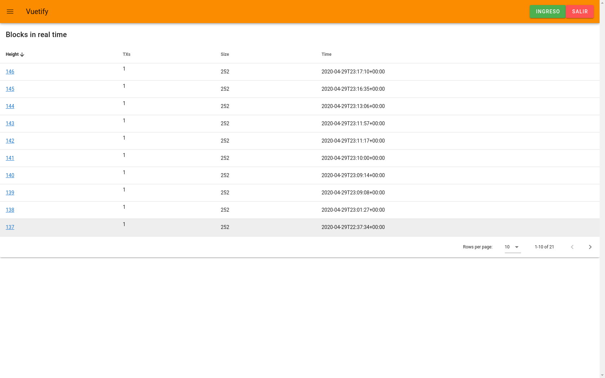

# bitcoind-wrapper


## Install v0.2: hasura + cron + subscriptions for websockets + front
- ```git clone https://github.com/aitorjs/bitcoind-wrapper```
- ```cd bitcoind-wrapper```
- make .env for front/bitcoind-zmq in front/bitcoind-zmq/.env with
```
VUE_APP_HASURA_PASS=secretkey
VUE_APP_HASURA_SCHEMA=ws://localhost:8080/v1/graphql
```

- To change the configuration or want you need inside .bitcoin, use
```$HOME/cyphernode/bitcoin/``` folder. Make bitcoin.conf here: <a href="#regtest">regtest</a> and <a href="#testnet">testnet</a>
- ```docker network create back```
- ```docker network create front```
- ```docker-compose up --build -d```
- Create block table inside postgreql:
```sh
- docker exec -it bitcoindwrapper_postgres_1 bash
- wget https://raw.githubusercontent.com/aitorjs/bitcoind-wrapper/master/docker/dbexport.pgsql
- psql -U postgres postgres < dbexport.pgsql
```
- Open on browser for hasura console: ```http://localhost:8080/```. ```secretkey``` is the password.
- Inside "Data" => "Untracked tables or views", click on the "Track" button for block.
- Click "Remote Schemas" -> "Add"
- As "GraphQL server URL" add "http://bitcoind-rpc:9000/"
- Open on a browser frontend: ```http://localhost:3001```
- <a href="#newblock">Generate new block</a>

## <span id="newblock">Generate new block inside bitcoin container on regtest</span>
- Enter to container with ```docker exec -it bitcoind-wrapper_bitcoind_1 bash```
- Generate new block: ```bitcoin-cli generatetoaddress [number-blocks] [address]```
- List of all addresses of the node: ```bitcoin-cli getaddressesbylabel ""```
- New bech32/segwit address: ```bitcoin-cli getnewaddress "main" "bech32"```

## <span id="regtest">bitcoin.conf example for regtest</span>
```
# Use the regtest network, because we can generate blocks as needed.
regtest=1

# RPC is required for bitcoin-cli.
server=1
rpcuser=paco
rpcpassword=paco

# In this example we are only interested in receiving raw transactions.
# The address here is the URL where bitcoind will listen for new ZeroMQ connection requests.
zmqpubhashblock=tcp://0.0.0.0:3000
zmqpubrawblock=tcp://0.0.0.0:3001
# zmqpubrawtx=tcp://0.0.0.0:3002
# zmqpubhashtx=tcp://0.0.0.0:3003

[regtest]
# ATTENTION: VERY DANGEROUS OUTSIDE THE DOCKER NETWORK
rpcbind=0.0.0.0:18443
rpcallowip=0.0.0.0/0
```
## <span id="testnet">bitcoin.conf example for testnet</span>
```
# testnet
testnet=1

# RPC is required for bitcoin-cli.
server=1
rpcuser=paco
rpcpassword=paco

txindex=1

# blocknotify=/usr/bin/curl -X GET bitcoindwrapper:3000/bitcoin/newblock/%s -H "accept: application/json" -H "Authorization: Bearer YOUR-TOKEN"

# In this example we are only interested in receiving raw transactions.
# The address here is the URL where bitcoind will listen for new ZeroMQ connection requests.
zmqpubhashblock=tcp://0.0.0.0:3000
zmqpubrawblock=tcp://0.0.0.0:3001
# zmqpubrawtx=tcp://0.0.0.0:3002
# zmqpubhashtx=tcp://0.0.0.0:3003

[test]
# ATTENTION: VERY DANGEROUS OUTSIDE THE DOCKER NETWORK
rpcbind=0.0.0.0:18332
rpcallowip=0.0.0.0/0
```

## Pre-requisites
```
- sudo apt-get install git docker.io docker-compose
- sudo usermod -aG docker $USER
- reload pc
```

## .cookie
```
paco:paco
```

## Ports

- 8080: Hasura console
- 3001: frontend (8081 with ```npm run serve```


## Miscelania

### TODO zmq

### hasura call to getblockcount
curl 'http://localhost:9000/' -H 'Accept-Encoding: gzip, deflate, br' -H 'Content-Type: application/json' -H 'Accept: application/json' -H 'Connection: keep-alive' -H 'DNT: 1' -H 'Origin: http://localhost:9000' --data-binary '{"query":"query {\n  getblockcount {\n    height\n  }\n}"}' --compressed

curl -X POST http://localhost:8080/v1/graphql -H 'x-hasura-admin-secret: secretkey' -H 'Content-Type: application/json' -d '{"query":"query{\n  getblockcount {\n    height\n  }\n}"}'

### bitcoin-rpc call to getblockcount
curl --user paco --data-binary '{"jsonrpc": "1.0", "id":"curltest", "method": "getblockcount", "params": [] }' -H 'content-type: text/plain;' http://bitcoind:18443

###  Add "Remote Schema" in hasura
- Go to hasura explorer: http://localhost:8080/
- Click "Remote Schemas" -> "Add"
- As "GraphQL server URL" add "http://bitcoind-rpc:9000/"

### Screenshot front/bitcoind-zmq


### Rebuild bitcoind-zmq-front
- ```cd front/bitcoind-zmq```
- ```npm run build```
- ```docker build -t bitcoind-wrapper_bitcoind-zmq-front .``` ¿can delete this tep?
- ```cd .. && cd .. && docker-compose up --build -d```

### For other containers
- ```docker stop```
- ```docker-compose up --build -d```

### getblock in graphql

query MyQuery {
  getblock(hash: "5dee5822368296e72c64bd1ba57bc6d038aecff38b0905416dfb544c3c2d2105") {
    bits
    tx {
      hash
      hex
      locktime
      size
      txid
      version
      vsize
      weight
      vin {
        coinbase
        sequence
      }
      vout {
        n
        scriptPubKey {
          addresses
          asm
          hex
          type
          reqSigs
        }
        value
      }
    }
    height
  }
}
